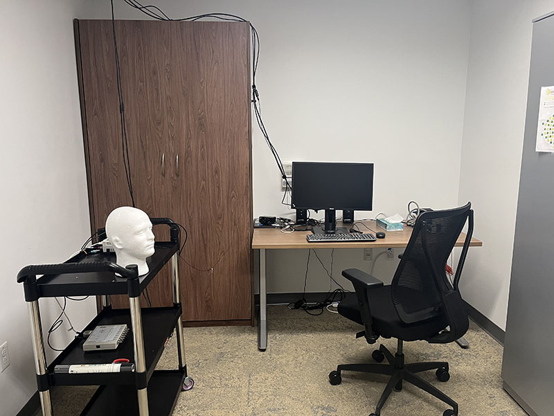
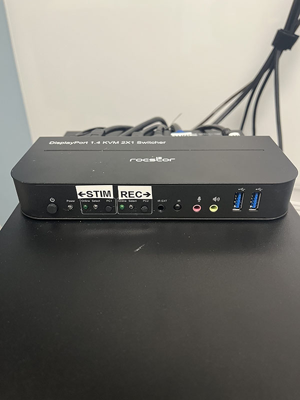

EEG: General tips and instructions
===================================

General Tips and Instructions
----------
* The EEG recording room (146) is electrically-shielded and `shown to have very low noise <../how-tos/EEG_noise>`_. Participants should be comfortably seated in front of the monitor. The EEG amplifier is located on a cart, which can be positioned behind the participant to reduce strain on the cable connections between the cap and amplifier.
* There is also a Murphy bed in the EEG room for sleep studies. The amplifier cart can be positioned to the side of the bed when used in sleep studies.

**EEG Recording Computer** 
* The EEG control room houses the recording and stimulus control computers. The recording computer should only be used to run the Brain Vision Recorder software and should not be connected to the ethernet or wifi network. 
*See the `EEG Recording how-to <../how-tos/EEG_recording>`_ for more on running the BrainVision Recorder software.

**Stimulus Control Computer**
* The stimulus control computer is used to display stimuli to the participant in the EEG recording room and to collect behavioral responses. Response and other event triggers may be embedded in the EEG data file (see `this tutorial <https://youtu.be/kXzood4I4QM?si=GeeaGB_us344T8ZN>`_ on designing effective trigger codes). 
* The stimulus control computer should be connected to the ethernet.
* Use your own PennKey and password to sign in to the stimlus control computer. It is a good idea to install the version of PsychoPy that you need for your experiment under your personal profile. This prevents version conflicts between different users' experimental paradigms. This also allows you to save behavioral data under your own profile. **Do not save any identifiable subject information on this computer**.

**KVM Switch**
*The monitor, keyboard, and mouse in the EEG recording room may be switched between the stimulus control and EEG recording computer by operating the KVM switch in the EEG control room. It can be helpful to display the EEG recording computer in the recording room during cap setup so the experimenter can see impedence values.

* Make sure the switch is powered on. Use the buttons marked "Stim" and "Rec" to select the stimulus control and recording computers, respectively.