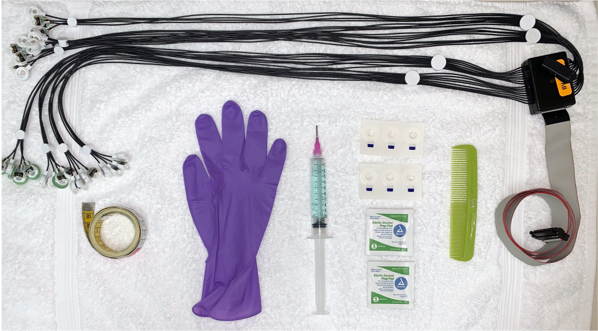
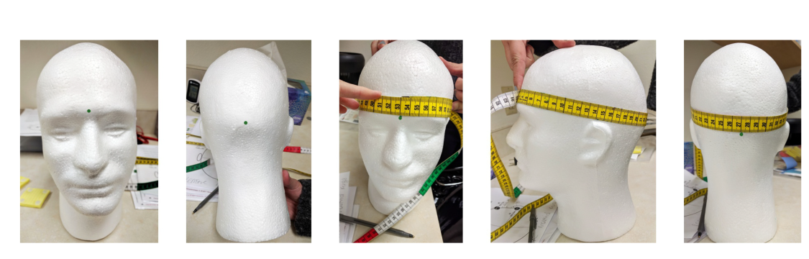
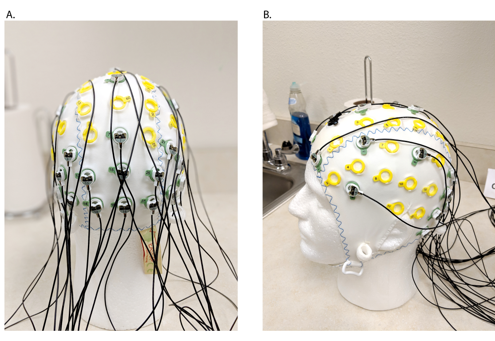
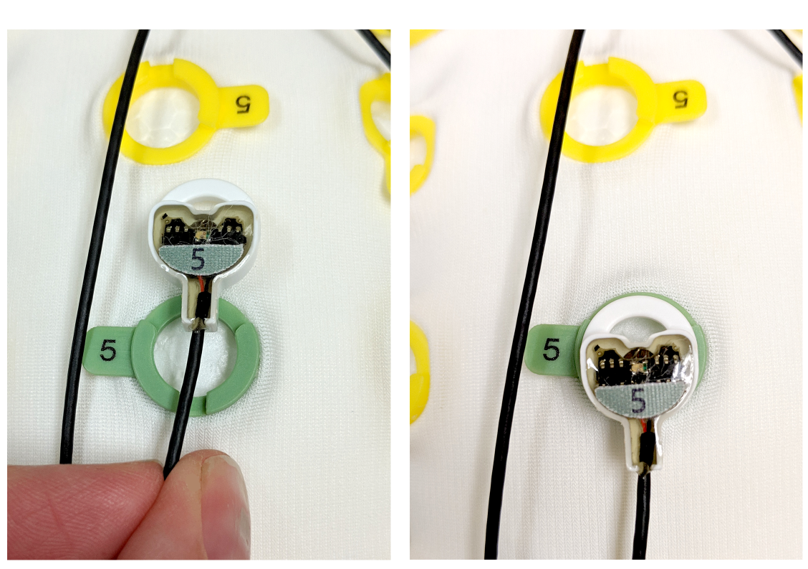
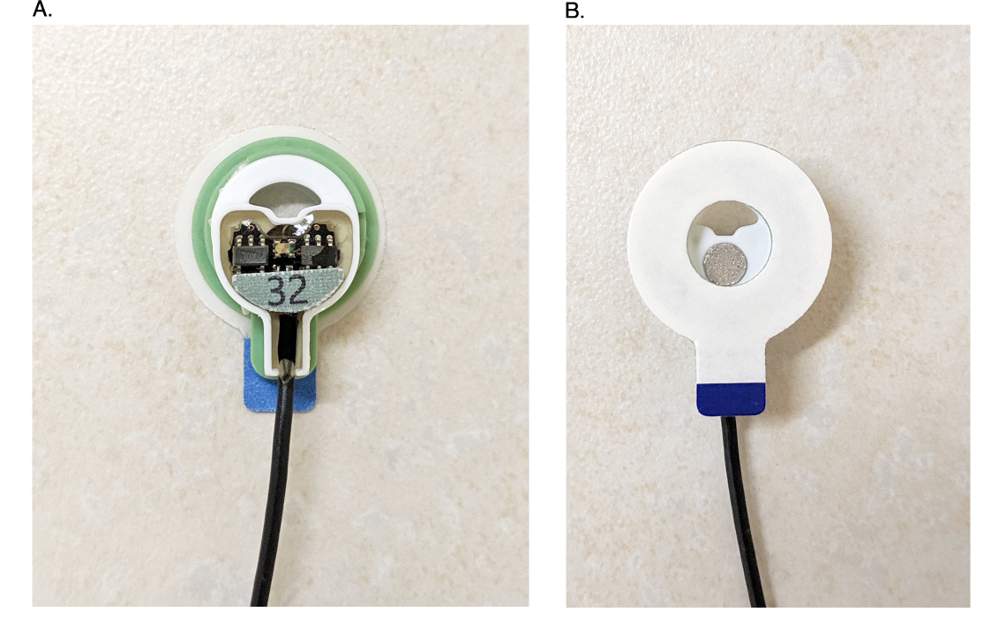
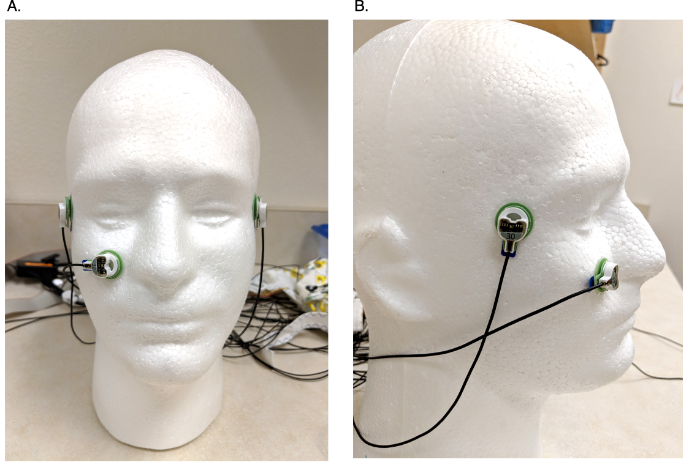
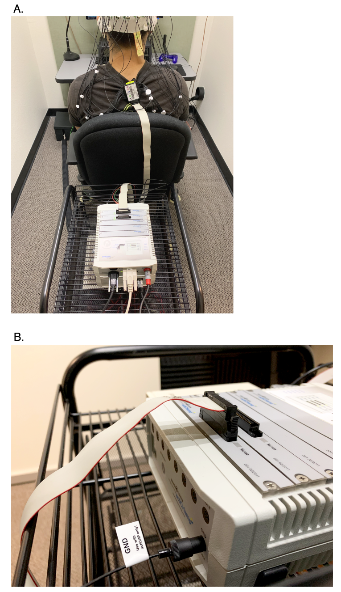

EEG: Detailed Recording Protocol
===================================

.. Note::
	Adapted from: Farrens, J. L., Simmons, A. M., Luck, S. J., & Kappenman, E. S. (2021). Electroencephalogram (EEG) recording protocol for cognitive and affective human neuroscience research. `https://doi.org/10.21203/rs.2.18328/v3 <https://doi.org/10.21203/rs.2.18328/v3>`_. 

Jump to
-------

* :ref:`abstract`
* :ref:`introduction`
* :ref:`procedure`
* :ref:`verification-of-stimulus-timing`
* :ref:`troubleshooting`
* :ref:`general-advice`
* :ref:`time-taken`
* :ref:`anticipated-results`
* :ref:`references`
* :ref:`resources`

----

.. _abstract:

Abstract
--------

Electroencephalography (EEG) is one of the most widely used techniques to measure human brain activity. EEG recordings provide a direct, high temporal resolution measure of cortical activity from noninvasive scalp electrodes. However, the signals are small relative to the noise, and optimizing the quality of the recorded EEG data can significantly improve the ability to identify signatures of brain processing. This protocol provides a step-by-step guide to recording the EEG from human research participants using strategies optimized for producing the best quality EEG.

----

.. _introduction:

Introduction
------------

The electroencephalogram (EEG) is one of the most widely used measures of human brain activity in the fields of psychology, psychiatry, and neuroscience. Although EEG recordings taken from electrodes on the scalp are non-invasive, they provide a direct index of the extracellular potentials that occur during neurotransmission in cortical pyramidal cells. Moreover, EEG signals are propagated instantaneously to the surface of the head, providing the temporal resolution necessary to isolate distinct aspects of sensory, cognitive, motor, and affective processes. Thus, the EEG contains many important signals, which can be extracted by methods such as signal averaging and time-frequency analysis to understand the human mind. However, the signals from multiple brain processes are mixed together in the EEG recording, and these signals are further embedded in biological and environmental noise. Although a variety of signal processing and analysis procedures can help to separate the signal of interest from the noise, their ability to work adequately depends on the quality of the original EEG recordings. There is no substitute for clean data.

The present protocol provides a detailed step-by-step procedure for recording scalp EEG signals from human research participants, with an emphasis on supplies, equipment, and techniques that improve the quality of the acquired data. The procedures were adapted from `Farrens et al. (2020) <https://doi.org/10.21203/rs.2.18328/v3>`_, which describe procedures developed over many years in the Luck and Kappenman laboratories and are optimized for the Brain Products actiCHamp active electrode system.

----

.. _procedure:

Procedure
---------

Prior to Arrival
~~~~~~~~~~~~~~~~

1. Send a reminder email or text 1-2 days before the study. Include the time, date, and `location of the testing session <https://mindcore.sas.upenn.edu/neuroimaging-facility/location-and-directions/>`_, as well as information about the general testing procedure (e.g., what to expect, how long it will take, etc.). Include a list of reminders, such as: “The procedures require us to put gel in your hair, which may get on your clothing. Do not wear any clothing that may be harmed by the gel, or you would not wish to get gel on (although the gel is water soluble). If you have an important event immediately after the testing session, it may be best to reschedule. Participants need to be completely awake during the experiment, so please have suficient amount of sleep before arriving. Arrive with clean, dry hair, and remove all ponytails, braids, wigs, extensions, hair clips, hats, etc., prior to arrival.”

.. Note::
	If a participant arrives wearing inappropriate clothing, disposable scrubs are available for them to wear over the clothing to avoid damage.

2. Lay out as much of the equipment prior to the subject’s arrival as you can. This includes the SuperVisc gel, syringes, syringe tips, towels, electrode collars, gloves, tape measure, and alcohol wipes (see Figure 1). Notify Dr. Kirwan if any of the consumable supplies are low.

    Figure 1. Electrode application materials laid out prior to subject’s arrival.

3. Unwrap a sterile Luer-Lock syringe.
4. Use the syringe to draw up approximately 10 ml of gel from the SuperVisc jar, then screw on the syringe tip. Gently push down on the plunger to squeeze out any air bubbles over the sink or trash can. If you are working with a partner, it can be more eficient to prepare two syringes (each with half as much gel), rather than a single syringe.

.. Note::
	* 10 ml of gel should be enough for 32 electrodes. If you are using 64 electrodes, you can either refill the syringe or prepare additional syringes in advance. If refilling the syringe, be sure to maintain proper sanitation by using a clean, uncontaminated syringe to transfer the gel; do not use a syringe that has previously contacted the subject’s scalp.
	* Any Luer Lock syringes and syringe tips that come in contact with the subject must be discarded or disinfected before re-use.

5. If the subject has participated before and you know their cap size, :ref:`electrode-application` steps 6-9 can also be completed prior to arrival.

.. _electrode-application:

Electrode Application
~~~~~~~~~~~~~~~~~~~~~

1. Obtain consent according to the procedure approved by the Institutional Review Board.
2. Seat the subject in a comfortable low-backed chair in the prep area.
3. Have the subject comb their hair using a plastic comb, instructing them to concentrate on their scalp. The purpose is to loosen up some of the dead skin on the scalp, which will help reduce electrode impedances.

.. Note::
   * If the subject arrives with wet hair or is sweaty, have them dry their hair with the hair dryer before beginning.
   * If your subject arrives with a ponytail, braid, wig, barrettes, hair clips, or extensions of any kind, they must be removed before continuing.

4. Put on a pair of gloves.
5. Measure the circumference of the subject’s head (in cm) using a soft tape measure, using the nasion and inion to define the measurement axis (see Figure 2). Select the cap that best fits your subject. See :ref:`common-electrode-issues` for more information on caps, cap sizes, and common fitting issues.

   Figure 2. Location of the nasion (panel A) and the inion (panel B) used to measure the circumference of the subject’s head (panels C, D, & E) to determine which cap size is appropriate.

6. Get the electrode set(s). 
7. Drape the electrode set over your neck with the plastic clip against your back. This should result in electrodes 1-16 on the left, and 17-32 on the right. This mirrors the way the subject will be wearing the electrode set and will help minimize tangling. The electrodes should be placed in the cap prior to putting the cap on the subject’s head. If using two sets,finish placing the first set before starting on the second
set.
8. Carefully slide the electrodes (except for the external electrodes) into the cap with the wires pointing towards the back of the cap (see Figure 3). This reduces tension on the wires during the recording and minimizes tangling. The bottom of the electrodes (wire end) should be slid into the top of the holder in a downward motion, not pushed in with an upwards motion from the bottom of the holder (see Figure 4). Be sure to push the electrodes all the way into the holders; they should make an audible ‘snap’ noise (although this snapping noise becomes less noticeable over time).

   Figure 3. Prepped electrode cap with wires properly pointing toward the back of the head, as viewed from the back (panel A) and from the side (panel B).

   Figure 4. Illustration of the direction the electrodes should be slid into the electrode holders.

9. Slide the Ground electrode into the cap, with the wire pointing towards the back of the cap.
10. Remove the electrodes from around your neck and clip the splitter box to the back of the subject’s shirt. Gently lay the cap onto the counter behind the subject or let it hang loosely down the subject’s back.
11. Using an alcohol wipe, clean skin areas behind the subject’s ears, beside each eye, and below the right
eye.

.. Note::
	The Luck and and Kappenman labs repurpose some scalp electrodes as external electrodes for measuring things like eye movements. Your lab's protocol may or may not include steps 12-14.

12. Isolate the five external electrodes from the electrode bundle. One at a time, carefully remove an electrode collar from the strip and place it over the center of the electrode, with the tail of the collar pointing down toward the wire (see Figure 5). Leave the top cover of the collar on; this will help prevent it from sticking to your glove until you are ready to place the electrode on the subject.

   Figure 5. Properly placed electrode collar on an external electrode, as viewed from the top (panel A) and bottom (panel B) of the electrode.

13. Completely fill the hole in the electrode collar with gel, making sure not to scrape the electrode pellet with the tip of the syringe (which can damage the pellet).
14. When ready to place an external electrode, remove the top of the collar and place the electrode on the prepared area. Repeat for all external electrodes. See Figure 6 for the proper placement of each external electrode described below.

   Figure 6. Properly placed Lower VEOG, Right HEOG, and Left HEOG external electrodes, as viewed from the front (panel A) and the side (panel B).

	a. HEOG Left & Right: Place in line with the subject’s pupil on the outer canthus of each eye, centered 1-2 cm of the distance between the canthus and the temple (avoid placing directly on the orbital bone). The electrodes should be oriented vertically with the wires pointing down to minimize strain on the wires. These electrodes may wind up being under the edge of the cap once the cap is placed on the head, but that is acceptable.
	b. VEOG Lower: Place below the right eye in line with the subject’s pupil. The electrode needs to be far enough below the eye that it does not interfere with the subject’s vision, but not so low that it does not detect blink activity. A good estimate for how far down to go is roughly in line with the subject’s right nostril. The electrode should be oriented horizontally with the wire pointing towards the subject’s right ear. Once placed, make sure the electrode is not interfering with the subject’s vision when they look straight ahead, and it is not in danger of falling off when the subject moves their cheek (as when talking). If so, remove and place again.
	c. Mastoids Left & Right: Place on the bony protrusion behind each ear, in line with the subject’s tragus. The electrodes should be oriented vertically with the wires pointing down. Avoid placing the electrode on the subject’s hairline to the extent possible, and keep the two mastoid electrodes aligned with each other. Also avoid placing them on the posterior auricular artery to minimize EKG artifacts.

15. Once all of the external electrodes have been placed, gently slide the cap onto the subject’s head. Make sure the tag is not tucked under the cap (which can prevent the gel from reaching the scalp for electrodes near the tag).
16. Use the soft measuring tape to make sure the cap is centered. The Cz (vertex) electrode holder should be exactly half way between the nasion and inion and exactly halfway between the left and right preauricular points. To readjust the cap, use both hands to slide/push the cap into place; avoid grabbing individual electrode holders and tugging or pulling the cap into place. This will stretch out the cap and is bad for the electrodes. Once the cap is centered front to back, visually ensure the cap is centered side to side. Re-adjust as necessary.
17. Once the cap is centered, have the subject close the chin strap to prevent the cap from moving. If the subject finds the chin strap uncomfortable or itchy, place a small piece of sterile gauze between the strap and the subject’s chin.

.. Note::
	Avoid making the chin strap too tight; you do not want the subject to feel like they are choking.

18. Begin filling each electrode with gel. To do so, hold the electrode in place with the index finger and thumb of your non-dominant hand. With your dominant hand, insert the syringe tip through the notch in the top of the electrode. Make sure the syringe is contacting the scalp, then swirl it around 3-4 times in a wide circular motion, pushing the hair out of the way and gently removing the top layer of dead skin cells. To fill the electrode with gel, push down on the plunger while slowly pulling the syringe up and out of the electrode. This creates a nice column of gel rather than a large glob at the bottom, reducing the potential for bridging (especially in high density recordings). Fill the electrodes in a systematic order to reduce the chances of skipping electrodes. Avoid placing your hand on top of any previously filled electrodes while holding the one you are currently working on in place. Be sure to fill the Ground electrode.

.. Note::
	The syringe tips can be intimidating to subjects. It is good to show the subjects that the syringes are not actually sharp by poking the palm of your glove-covered hand a few times. Let them know that the procedure should not be painful in any way, and if it becomes uncomfortable at any time they should let you know immediately. FP1, Fz, and FP2 are frequently over bare skin; these locations can be sensitive, so take extra precaution when filling these electrodes.

Running the Subject
~~~~~~~~~~~~~~~~~~~

1. When all electrodes are prepped, take the subject into the testing room, leaving their backpack, purse,
cellphone, etc. outside the testing room.
2. Have the subject sit with their feet flat on the fioor and their bottom all the way to the back of the chair. Adjust the chair height so the subject is sitting with their knees bent at a comfortable angle (~90°), and then adjust the height of the monitor on the height-adjustable table so that the center of the screen is
level with their eye gaze. Make sure the subject is not seated too near external speakers (See :doc:`../how-tos/EEG_noise`). 
3. Plug the battery into the amplifier.
4. Plug the electrode set(s) into the amplifier by lining up the white triangle on the connecter pin with the white triangle on the amplifier port. Keep the electrode cables from hanging at odd angles or stretching to reach the subject when plugged into the amplifier; this can cause artifacts during the recording and places unnecessary mechanical stress on the equipment (see Figure 7). See :ref:`testing-room-setup` for tips on how to prevent this.

   Figure 7. Illustration of optimal amplifier placement (panel A) and unstrained cables connecting the electrodes to the amplifier (panel B).

5. Plug the Ground electrode into the port labeled ‘GND’ on the front right side of the amplifier, making sure to line the pins up correctly; the notch in the plastic housing should be facing up.
6. Open Recorder on the data acquisition PC. Load the correct configuration file, then select ‘Impedance
Mode.’
7. Use the DisplayPort switch to make the subject testing room monitor a clone of the data acquisition monitor.
8. Manually set the impedance threshold to "75." This will ensure that any electrodes over 50 kΩ turn red

.. Note::

	See `here <https://pressrelease.brainproducts.com/active-electrodes-walkthrough-slim/#2g>`_ for details on optimal impedance thresholds.

9. Make sure all impedances are below 50 kΩ. For any electrodes with higher impedances, reduce the impedance by inserting your syringe tip, making sure it is contacting the scalp, then re-swirling it a few times. If that does not work, try adding a bit more gel. Do not add more gel first, as this increases your risk of bridging between electrodes, especially in high density recordings. For experiments in which data quality is exceptionally important (e.g., ERP decoding experiments), reduce the impedances to <10 kΩ when possible without causing significant discomfort.

.. Note::
	See :ref:`common-impedance-issues` for more details on common impedance issues and how to solve them.

10. Once the impedances are all below the desired level, hit ‘Default Mode’ and check the EEG signals. It is still possible to have noisy electrodes even with low impedances. Adjust as necessary.
11. Show the subject their EEG and EOG signals. Describe common movement artifacts, how to prevent them, and why they matter. This helps the subject understand why they are being asked to minimize certain behaviors and allows you to ensure that all artifacts are easily identified with the placement of the electrodes.

	a. Eyeblinks: Ask subjects to look at the center of the recording screen and to blink 4-5 times in rapid succession. This shows them what their blinks look like and, depending on your task, why you may need them to withhold their blinks until certain time points (e.g., after their response on each trial). Check to make sure the blinks are appearing in the proper channels; there should be little to no blink activity detected in the HEOG channels. If you see large blink activity in either HEOG channel, you will need to remove the electrode and place it more evenly in line with the subject’s canthus. Make sure the polarity of the VEOG Lower electrode is correct (e.g., negative) and that the signal is the expected size. It is possible that an electrode was placed in the wrong location (for example HEOG Left in VEOG Lower’s place).
	b. Eye Movements: Ask the subject to look at the center of the recording screen and to look back and forth between the left and right edges of the monitor a few times while leaving their head stationary. This should produce large, rectangular defiections in the HEOG Left and HEOG Right channels (with opposite-polarity defiections for the Left and Right channels). If this is not the case, re-adjust the electrode(s) as necessary and check to confirm they are placed correctly to the left and right sides of the eyes.
	c. Concentration Face: Ask the subject to clench their teeth and furrow their brow. This demonstrates the most common artifacts caused by a subject’s "concentration face." Remind the subject that it is important to keep their face, jaw, and neck as relaxed as possible throughout the experiment to help minimize this muscle noise.
	d. Chewing: Ask the subject to pretend to chew gum. This demonstrates why it is important for them to completely finish eating their snack(s) before beginning the next block of the task. It is also a good opportunity to make sure your subject is not chewing gum before beginning.
	e. Alpha waves: For most participants, asking them to close their eyes while relaxed should produce visible bursts of alpha waves. This is a brainwave that is undesirable in many experiments and will illustrate the need to stay awake during the experiment.

12. Check the temperature of the room and the lighting level. Adjust as necessary.

.. Note::
	See :ref:`testing-room-setup` for more information on recommended temperature and lighting levels.

13. Explain the audio/visual monitoring set up to the subject.

.. Note::
	See :ref:`testing-room-setup` for more information on recommended audio/visual set-up.

14. When ready to begin the experiment, use the DisplayPort switch to change back to a clone of the stimulus presentation computer.
15. Explain the task to the participant. Reiterate any special EEG artifact instructions like maintaining fixation or withholding blinks until a certain time. Assure the subject that there are many breaks throughout the experiment and they are free to move around as much as they need to during those portions of the experiment. However, before beginning the task again, they must return to a still and relaxed position.

.. Note::
	See :ref:`optimal-task-settings` for more details on recommended break settings.

16. To begin recording the EEG, hit the ‘Start Recording’ button. Start your recording approximately 10 seconds before the task begins and end the recording approximately 10 seconds after the task ends. This minimizes edge artifacts when filtering the EEG data ofiine.
17. Monitor the EEG data closely at all times. Do not read books or journal articles, do homework, look at web sites, read email, send texts, etc. In most cases, the experimenter should not have their cell phone nearby, which reduces the temptation to engage in distracting activities.

	a. Make sure all stimulus event codes and response event codes are present on the Recorder recording screen.
	b. Check behavioral performance continually to ensure that the participant understands the instructions, is complying, and is not becoming drowsy or unmotivated (e.g., is keeping their eyes open and fixated on the screen, etc.).
	c. If you see evidence of a problem with the recording (e.g., excessive noise, excessive artifacts, etc.), fix the issue as soon as possible. Depending on the task and the type of problem, this can be accomplished at the next break, or it may be beneficial to pause the task to address the issue before continuing. See Examples of Commonly Recorded Artifactual Potentials and How to Fix Them for more detailed examples.
	d. If the participant exhibits artifacts that are particularly problematic for the experiment being run (e.g., eye movements in an N2pc, PD, or CDA experiment, blinks that frequently occur during the presentation of a visual stimulus, etc.), gently remind the participant to avoid that artifact. 
	e. If a participant is unable to perform the task with an appropriate level of accuracy or without excessive artifacts, terminate the session early and document the issue(s).
	f. Regularly check the subject video camera monitor to make sure that the participant is behaving appropriately (e.g., feet still fiat on the fioor, remaining still, maintaining fixation, etc.).
	g. If the participant is becoming drowsy (as evidenced by poor task performance, excessive alpha waves, or visibly nodding off), offer the subject a snack or beverage. Turning the lights to full brightness and allowing the subject to stand and stretch their legs at the next break can also help alleviate drowsiness. Music, in some cases, can also help prevent drowsiness. See Optimal Task Settings for more detailed information on the pros and cons of subject snacks and music.

Clean Up
~~~~~~~~

1.  Unplug the electrode cable(s) from the amplifier and disconnect the Ground. Do not pull the Ground by its wire, but instead grab it by the plastic housing to remove it.
2. Plug the battery back into its charger.
3. Walk the subject back to the prep area. Release the chin strap. Remove all of the external electrodes by pulling up from the collar tab; do not pull the electrodes by the wire. Remove the electrode collar from the electrode immediately; the collars are extremely sticky and will cause the electrodes to tangle together if left on.
4. Once all of the external electrodes are removed, gently slide the cap backwards off the subject’s head and unclip the electrode set from their shirt. Set everything aside.
5. Clean the subject’s hair in whatever way they want (wet towel, simple rinse, full hair wash, etc.), then compensate the subject and allow them to leave. Don’t make them wait while you clean everything up.
6. Once the subject has left the lab, unplug each electrode from the cap by gently sliding the electrode up and out of the holder with your thumb and forefinger.
7. Once all of the electrodes are removed, set the cap aside and clip the electrode set(s) to the back of your shirt (this ensures the splitter box(es) won’t get wet).
8. Working in small bundles of eight, hold the electrodes in a tight clump with the notch pointing upward. Rinse the top of the bundle with cool or lukewarm water for several seconds, then doublecheck to make sure that all of the gel is removed. Repeat with the rest of the electrodes. If necessary, hold each electrode under the faucet and gently rub the notch of the electrode with a soft toothbrush. When done, rinse off the wires by gently rubbing any wet patches with a cloth towel or paper towel.

.. Note::
	As we have a metal sink, you will need to place something in the bottom of the sink to prevent the electrodes from contacting the metal, as this can damage the electrodes. The plastic colander works well for this.

9. Disinfect the electrodes by submerging them in fully concentrated Envirocide for 3 minutes (using the timer to ensure the correct duration). Rinse thoroughly with water to remove all of the Envirocide when done.
10. Hang the electrodes on top of the wall hooks with the clip facing up, the flat part of the splitter box facing down, and the electrodes away from the sink (i.e., toward the door). Hang the Ground electrode over the top of the hooks as well.
11. To clean the cap, turn it inside out and go over each hole with lukewarm water. When done, turn the cap right side out and rinse off the outside of the cap. Do not use hot water to clean the cap; use only room temp or cold water to prevent damage to the elastic in the cap.
12. Disinfect the cap by submerging it in Envirocide for 3 minutes. Rinse thoroughly with water when done. The water should run clear once all of the Envirocide is removed. The water will look ‘soapy’ if there is still Envirocide left in the cap.
13. Hang the cap to dry on a wall hook or place on a small fan to dry. 
14. Disinfect the comb used at the beginning of the experiment by submerging it in Envirocide for 3 minutes. Rinse with water when done and remove any hair left in the comb.
15. Clean up the prep station, wipe down the sink, and dry off the chair. Hang the dirty towels on the edge of the hamper to dry and throw away any leftover subject snacks, electrode stickers, alcohol pad wrappers, etc.
16. Place dirty towels in the hamper.

----

.. _verification-of-stimulus-timing:

Verification of Stimulus Timing
-------------------------------

1. The timing of the video display output with respect to the stimulus event codes must be tested. This is accomplished by using the photosensor that is available for use with the actiCHamp system to record the change in light emitted by the video display when a stimulus is presented. This test should be performed before the first subject is tested in the experiment (e.g., when the experiment is initially set up) and on a regular basis thereafter.
2. Connect the photosensor to one of the auxiliary inputs on the amplifier unit.
3. Using an electrode collar, attach the photosensor to the subject’s monitor at the location on the screen where the stimuli will appear.

.. Note::
	In experiments with multiple stimulus locations, multiple timing tests (or multiple photosensors) may be required.

4. Open Recorder and begin recording. The scale of the photosensor output is typically much larger than standard EEG; changing the scale of the recording from µV to mV is often necessary to see the photosensor output. You should see a pulse of activity in the photosensor signal during each stimulus onset and offset for stimuli presented at the location on the screen where the photosensor is positioned (stimuli that are presented elsewhere on the screen will not be detected).

.. Note::
	For this type of testing, it is helpful to have a configuration file that displays and records only the auxiliary channel representing the photosensor.

5. The timing of the photosensor signal is then measured ofiine relative to the timing of each event code. If there is a constant delay (e.g., always 20±1 ms), the time of each event code can be adjusted during the offliine data processing procedures by this amount to align the event codes with the stimulus timing. If the delay is variable across events (e.g. 20-40 ms), this indicates a problem with the programming of the task or the stimulus presentation program and should be remedied before collecting data in the experiment.
6. In some cases, it may be useful to permanently mount a photosensor to the subject’s video display to record the actual light produced by the display during every recording session. It should be placed at the far edge of the monitor so that it is not visually distracting to the participant. The task is then programmed so that a small “calibration” stimulus is presented at the location of the photosensor at the same time as each task stimulus. If desired, different intensities can be used for different stimuli, which provides an additional means of determining whether the event codes accurately indicate which stimulus was presented. A cardboard mask can be placed over the edge of the monitor so that the subject cannot see the photosensor or the calibration stimuli.

----

.. _troubleshooting:

Troubleshooting
---------------

.. _common-electrode-issues:

Common Electrode Application Issues
~~~~~~~~~~~~~~~~~~~~~~~~~~~~~~~~~~

1. Choosing a cap size: Round to the nearest size. You can also quickly try one of the two closest sizes on the subject; if you decide to change sizes, you must disinfect both caps.
2. If the cap does not fit snugly in a certain area, but fits well overall, you can use Surgilast to help the cap fit better in the loose area. Simply cut off a 1-2 inch piece of the Surgilast fabric and stretch it around the appropriate section of the cap to hold it in place.

.. _common-impedance-issues:

Common Issues in Impedance Mode
~~~~~~~~~~~~~~~~~~~~~~~~~~~~~~~

1. Always check the Ground first; if the impedance of the Ground is high, the rest of the electrodes will show high impedance.
2. If all of your impedance values are jumping around, adjust electrodes 1 & 17 (e.g., the first electrode on each side of the splitter box).
3. If you are getting an impedance reading at a site that is so high it doesn’t register a number, you most likely forgot to put gel at that electrode location. If this occurs at O2, make sure the tag is not tucked up under the electrode.
4. If you try to adjust an electrode multiple times and you still cannot get a reading, the electrode may be broken (but this is very rare). Try swapping locations with a working electrode and see if it gets a reading at the new location. If so, you just need to prepare the area better. If it is still not registering, you can replace the electrode and do a full test of the electrode later. Follow the instructions `here <https://www.brainproducts.com/filedownload.php?path=products/brochures_material/actiCAP_Replacement_Electrodes_V005.pdf>`_ for how to replace an electrode, and see Testing for Broken Electrode(s) (below) for details on how to test electrodes.
5. High impedances at posterior/occipital sites are sometimes caused by excess hair bunching behind the ears. To fix this, spread the subject’s hair around the neck as thinly and evenly as possible. Always remove a subject’s ponytail or braid before beginning.
6. If nothing is working, try restarting the computer as well as unplugging and re-plugging all of your cables. It may be necessary to re-install a driver.

Testing for Broken Electrodes
~~~~~~~~~~~~~~~~~~~~~~~~~~~~~

1. Fill a small bucket with one liter of warm water, then add three tablespoons of non-iodized salt. Place the electrodes and Ground into the bucket of water, and plug them in to the amplifier. In Recorder, run the “Test Mode” and “Electrode LED Test Mode.” If an electrode is broken, it will appear as a flat line rather than a square wave in Test Mode. If an LED is broken, it will not glow during the LED Test Mode.
2. If an electrode is identified as broken, follow the instructions `here <http://www.brainproducts.com/filedownload.php?path=products/brochures_material/actiCAP_Replacement_Electrodes_V005.pdf>`_ for how to replace an electrode.

Examples of Commonly Recorded Artifactual Potentials
~~~~~~~~~~~~~~~~~~~~~~~~~~~~~~~~~~~~~~~~~~~~~~~~~~~

1.  If a subject is blinking excessively, it may be because their eyes are dry. Providing single-use eye drops is a great way to solve this problem. Subjects who wear contact lenses tend to blink more frequently than subjects who do not wear contacts. Blink rate can also be infiuenced by medication.
2. If using the mastoids as your reference electrode(s), EKG artifacts may be present in the recording. To alleviate this problem, try placing the mastoid electrode(s) further up and closer toward the ear. To avoid this problem altogether, you may wish to use P9 & P10 (located adjacent to the mastoids) as the reference in a given study, or some other scalp sites located in that region (e.g., TP9 & TP10) if P9 & P10 are not in the recording montage. However, all subjects in a given study should have the same reference.
3. It is common to have increased muscle noise at frontal and temporal electrodes (e.g., F7/F8, T7/T8, FP1/FP2). Sometimes this can be fixed by telling the subject to relax their face and neck, but for some subjects there is not much you can do about it. If the subject is wearing glasses, the frames of the glasses can sometimes press on these electrodes and cause increased muscle tension; try adjusting the glasses if possible.

.. Note::
	Glasses should always be worn outside the cap.

4. If you see a certain kind of noise/artifact occurring in all the channels at the same time, rather than in a subset of the channels, the problem is in your reference electrode(s) or your ground electrode (if recording without a reference). Adjust as necessary.
5. If you are recording EEG from an individual from a special population (e.g., children, patient populations), it may be more appropriate not to provide explicit artifact instructions. Asking participants to monitor their artifacts is essentially creating a dual task situation, which may impair performance more in a special population than in a control group. For more information, see `Kappenman & Luck (2016) <https://doi.org/10.1016/j.bpsc.2015.11.007>`_.
6. If you see what looks like pure 60 Hz noise in a single channel, you most likely have a broken electrode. Replace the broken electrode or switch to a new electrode set before continuing.
See `here <https://www.brainproducts.com/filedownload.php?path=products/brochures_material/actiCAP_Replacement_Electrodes_V005.pdf>`_ for instructions for how to replace a broken electrode, and see Testing for Broken Electrode(s) (above) for details on how to test electrodes.
7. If you see a channel that ‘wanders’ or ‘drifts,’ this can sometimes be caused by poor contact between the electrode and the scalp. Try gently filling with a little more gel, or use Surgilast to hold it down. This is particularly common at the very top of the head and at posterior/occipital electrodes. It can also be caused by skin potential artifacts from sweating; make sure your testing room is set to the optimal temperature for testing (see Testing Room Set-Up below).
8. Although uncommon, it is possible that your battery will die mid recording; having an extra back-up battery is a simple way to solve this problem.

----

.. _general-advice:

General Advice
--------------

.. _cap-and-electrod-setup:

Cap and Electrode Set-Up
~~~~~~~~~~~~~~~~~~~~~~~

**Modular caps**: Brain Products caps are designed with a yellow/green color-coding system that allows 32- or 64-channel recordings to be obtained with the same set of electrode caps. For 32-channel recordings, one set of 32 electrodes is plugged into the cap using only the green electrode holders. For 64-channel recordings, sets of 32 electrodes are plugged into the cap, one using the yellow electrode holders and one using the green electrode holders. The holders are easily moved to different positions in the cap if a new electrode configuration is desired. The electrode sets are labeled with the numbers 1-32 to make the electrode sets interchangeable.

.. _testing-room-setup:

Testing Room Set-Up
~~~~~~~~~~~~~~~~~~

1. Subject chair and amplifier cart placement: the chair should be placed so that the subject’s viewing distance to the screen remains constant (e.g., 100 cm). Place the cart with the amplifier directly behind the subject’s chair such that the wires to hang straight down from the back of the subject’s head and reduces strain on the cables (see Figure 7 and Figure 12a). You may wish to mark the correct positioning of the chair on the floor, and subjects should be instructed not to move the chair.
2. Optimal room temperature: The optimal temperature of the testing room is 68-72 degrees Fahrenheit, and this is especially important if high impedance recordings will be used (Kappenman & Luck, 2010). There is a thermostat in the testing room that you may need to adjust. **Do not run a fan inside the testing room during the recording**; this may produce large electrical artifacts.
3. Optimal lighting level and how to regulate it: The optimal lighting level of the room for most experiments is ‘comfortably dim.’ This ensures that participants do not become too drowsy during the recording without getting glare from the monitor. There is a dimmer for this purpose on the light switch in the testing room. 

.. _optimal-task-settings:

Optimal Task Settings
~~~~~~~~~~~~~~~~~~~~~

1. Break settings: In most experiments, stimulus presentation script should include brief (e.g., 15-30 second) breaks every 1-2 minutes. For example, the screen will say something like “Rest your eyes”, and an onscreen counter will count down from 10 seconds, ending with “Ready,” “Set,” and “Go.” Alternatively, the break can be subject-mediated, and a message “Press a button when you are ready to continue” can be displayed. Every 5-10 minutes, provide the participant with a longer break. At this point, talk to the participant over the microphone or go into the subject room. Depending on the state of the participant, this break can be brief (e.g., 30 seconds) or long (e.g., a few minutes). If the subject is excessively sleepy, it may be useful to turn the lights on brighter (only during the break) or to allow the subject to stand up and move around.
2. Because it is often necessary to pause in the middle of a block, repeat a block, etc., it is important that the stimulus presentation script provides the experimenter with options for pausing and for restarting or repeating blocks.
3. It is also best practice to save several smaller recording files rather than one long file, and break periods provide a good opportunity to start a new recording. This prevents you from losing as much data if something goes wrong during the recording, and it also gives you the opportunity to check impedances during the breaks.

----

.. _time-taken:

Time Taken
----------

* Electrode application: 15-30 min (for 32 electrodes)
* Impedance adjustments: 5-10 min
* Recording: variable (depending on task duration)
* Electrode removal and clean up: 20 min

----

.. _references:

References
----------

Kappenman, E. S., & Luck, S. J. (2010). The effects of electrode impedance on data quality and statistical significance in ERP recordings. *Psychophysiology*, 47, 888-904. `https://doi.org/10.1111/j.1469-8986.2010.01009.x <https://doi.org/10.1111/j.1469-8986.2010.01009.x>`_ 

Kappenman, E. S., & Luck, S. J. (2016). Best practices for event-related potential research in clinical populations. *Biological Psychiatry: Cognitive Neuroscience and Neuroimaging*, 1, 110-115. `https://doi.org/10.1016/j.bpsc.2015.11.007 <https://doi.org/10.1016/j.bpsc.2015.11.007>`_ 

Luck, S. J. (2014). *An Introduction to the Event-Related Potential Technique* (2nd ed.). MIT Press. (Select chapters available for free download `here <https://erpinfo.org/free-online-chapters>`_)

----

.. _resources:

Resources
---------
* BrainVision's `tips and tricks for cap cable management <https://pressrelease.brainproducts.com/acticap-setup/>`_
* `BrainVision Recorder software <https://www.brainproducts.com/solutions/recorder/>`_
* `How to replace an active electrode (actiCAP) <https://www.youtube.com/watch?v=C7Xnb4ImJcc>`_
* BrainVision `user manuals <https://www.brainproducts.com/downloads/manuals/>`_

