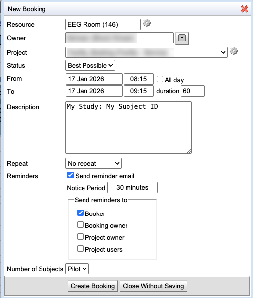

EEG: Scheduling and setting up the EEG recording suite
===================================

Overview
----------
The EEG recording suite at the MindCORE Neuroimaging Facility comprises an electrically-shielded recording room (146) and a control room (145) where the EEG recording and stimulus control computers are located. This document describes the scheduling procedure and some basic set up recommendations for the EEG suite.

Scheduling
----------
* The EEG suite is scheduled using the `calpendo scheduler <https://upenn-mindcore.calpendo.com/>`_ (see `Calpendo Signup <../how-tos/calpendo_signup>`_ to set up an account). Select the "EEG Room (146)" calendar from the Resources list and highlight the date and time you wish to book to start a new booking (see figure below). Note that "Project" and "Number of Subjects" are required fields to complete a booking. If your user account is not associated with an existing project account, please contact the Facility Director to add you to a project account. 
* Use of the EEG equipment is billed per subject (rather than per hour). Please specify the number of subjects to be run during the booking period. If you will not be running a subject and merely need to book the space, select "Pilot". 
* Other fields are not required but may be helpful. Please do not add identifiable subject information (i.e., names) in the Description field (subject IDs are OK). Click "Create Booking" to save your booking. 

