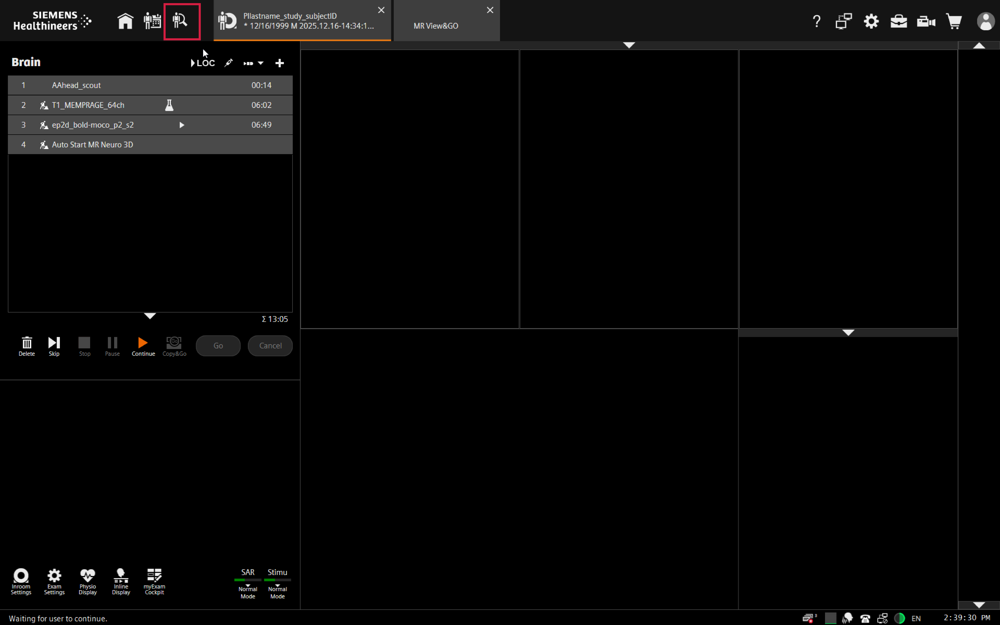

MRI: Archive MRI Data
===================================

Overview
----------
The MRI scanner is set up to automatically send all scan data to the data transfer computer in the MRI control room. It is a good idea to ensure this backup is happening during your scan session as data transfer can take considerable time at the end of your scan, particularly if you have a data-intensive protocol. This how-to walks you through how to check for automatic backups and how to push them again if they have failed.

Procedure
----------
* From the examination screen, select the "Patient Browser" at the upper left of the screen.

* *Alternate*: you can also get to the Patient Browser by pressing the keyboard shortcut with this symbol:

* In the Patient Browser window, click on your participant in the list on the left to select the whole scan session. If your scans have been automatically backed up, all completed scans will have a green checkmark to the right. Any problems will be indicated by a red "x". Typically, backup problems are because the database software (Horos) quit or is frozen on the data transfer computer. 
* If your scans have not been backing up:
	* Quit (or force quit) then restart Horos on the data transfer computer.
	* Select the participant to be backed up by clicking on their entry in the Patient Browser
	* Click on "Send to Archive"

	.. image:: ../images/backup2.png

	* You can check on the status of your transfer by selecting the "Jobs" menu, then the "Network" tab on the left

	.. image:: ../images/backup3.png

