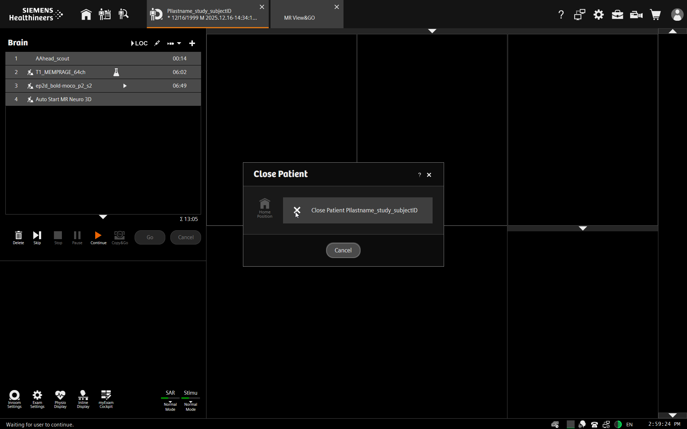

MRI: Closing Out a Participant Scan
===================================

Overview
----------
In addition to cleaning up the scanner room at the end of your scan session, you must also close out any open scan sesisons and data views.  

Procedure
----------
* From the examination screen, close the scan session by clicking the [x] on the examination tab. Select "Close Patient". 
* **Warning**: Do not click on "Home Position" from the control room. Rather, research personnel should return participants to the home position using the buttons on the scanner itself. This allows study personnel to be on hand in case there is any problem with the participant moving out of the scanner. For example, if cables, clothing or blankets becoming tangled personnel can spot it and prevent it or press the table stop button quickly.

* Close out the "MR View and Go" tab by clicking on the [x]. Select "Discard Changes".

.. image:: ../images/MRI_close2.png

* Click the home screen icon to return to the home screen.
