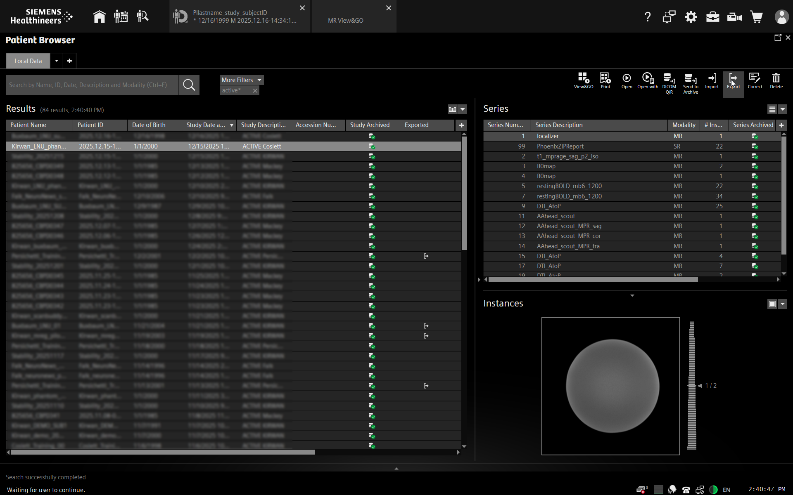
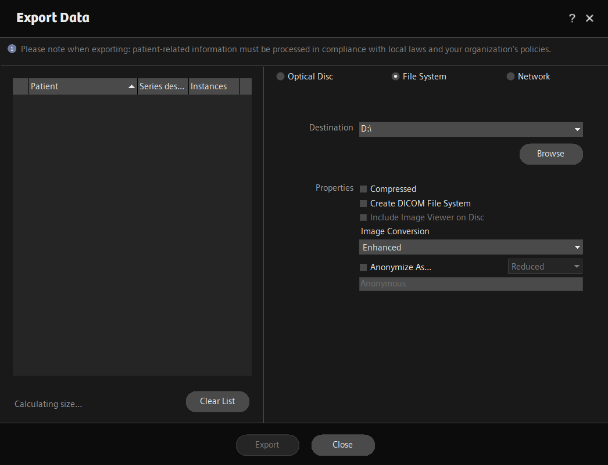

MRI: Exporting MRI Data
===================================

Overview
----------
While the MRI scanner is set up to automatically back up all scan data to the data transfer computer, some users may wish to export their data to removable media (i.e., a USB drive) directly from the MRI console computer. This how-to describes the process for exporting directly from the scanner. 

Procedure
----------
* From the examination screen, select the "Patient Browser" at the upper left of the screen.

.. image:: ../images/backup1.png

* *Alternate*: you can also get to the Patient Browser by pressing the keyboard shortcut with this symbol:

.. image:: ../images/patient_browser.png

* In the Patient Browser window, click on your participant in the list on the left to select the entire scan session. 
* Select "Export" from the options at the upper right

* Make sure your USB drive is plugged into the console computer. If it is, you should be able to select it as the "Destination" in the pop-up window by clicking "Destination".

* Make sure the export options are as in the image above: "Compressed" and "Create DICOM File System" should **not** be selected. Make sure "Enhanced" is selected for "Image Conversion" and do not select "Anonymize". If everything is correct, click on "Export". 

* You can check on the status of your export by navigating to the "Jobs" viewer and then selecting the "Media" tab at the left.

* It is not necessary to eject the USB drive before disconnecting it from the console computer.