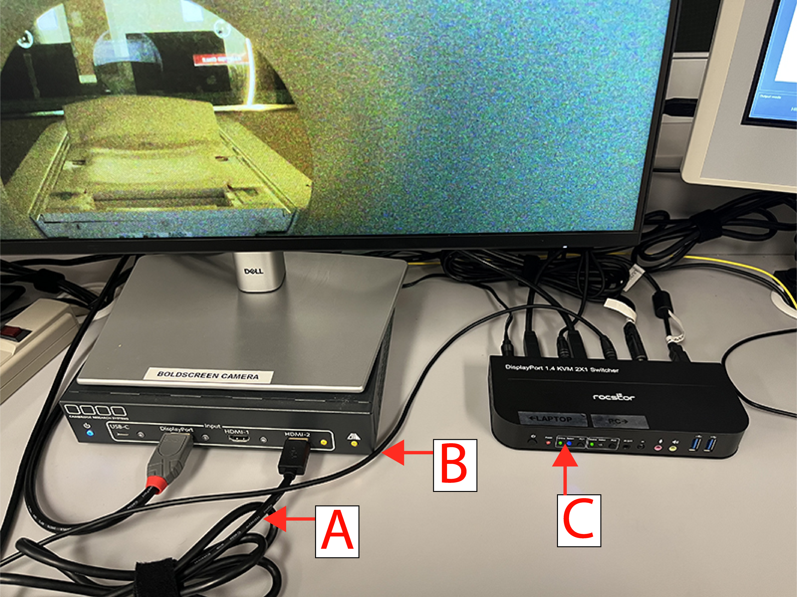

Using an external laptop for fMRI
===================================

Overview
----------
Some users may wish to use their own laptop to display stimuli and record responses in fMRI studies. The following are procedures for connecting a laptop to the stimulus presentation and response systems. 

Procedure
----------
Please follow these procedures when connecting an external laptop for fMRI studies:

1. To connect to the BOLDscreen monitor, plug the HDMI cable in to your laptop (labeled "A" in the figure below). An adapter is provided in case your computer has a USB-C port rather than an HDMI port (i.e., if you have a Mac). Make sure the BOLDscreen input selector box is powered on (blue button) and the proper HDMI input is selected.

2. A KVM switch is used to control the button box output and audio input. If you are using audio in your experiment, use the 3.5mm audio input cable ("B" in the figure) to connect to your computer. Be sure to test your audio volume levels in the MRI scanner room prior to starting your experiment. Make sure the KVM switch is powered on and "laptop/PC1" is selected ("C" in the figure).

3. The same KVM switch is used for the button box/response system. Connect to the KVM switch via the USB-A cable. As most modern laptops (expecially Macs) have USB-C ports, the same adapter as the HDMI can be used for the button box. Make sure the Current Designs response system is powered on and the proper response device and output mode are selected. Make sure the KVM switch is powered on and "laptop/PC1" is selected ("C" in the figure).

.. Note::
	You must select both the HDMI input on the BOLDscreen control system and the laptop input on the KVM switch when using an external laptop. It's easy to select one input and forget the other.

