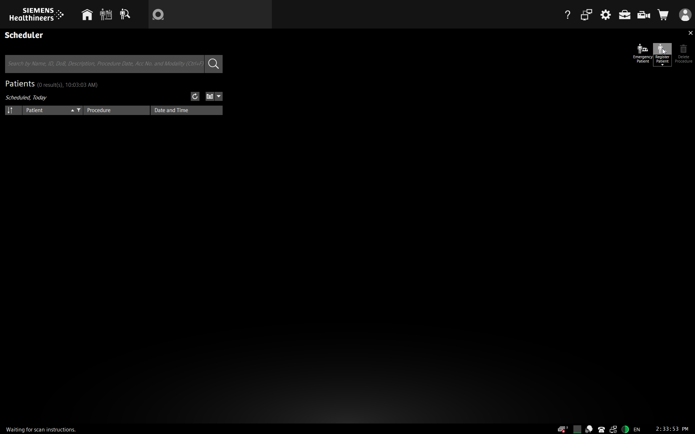
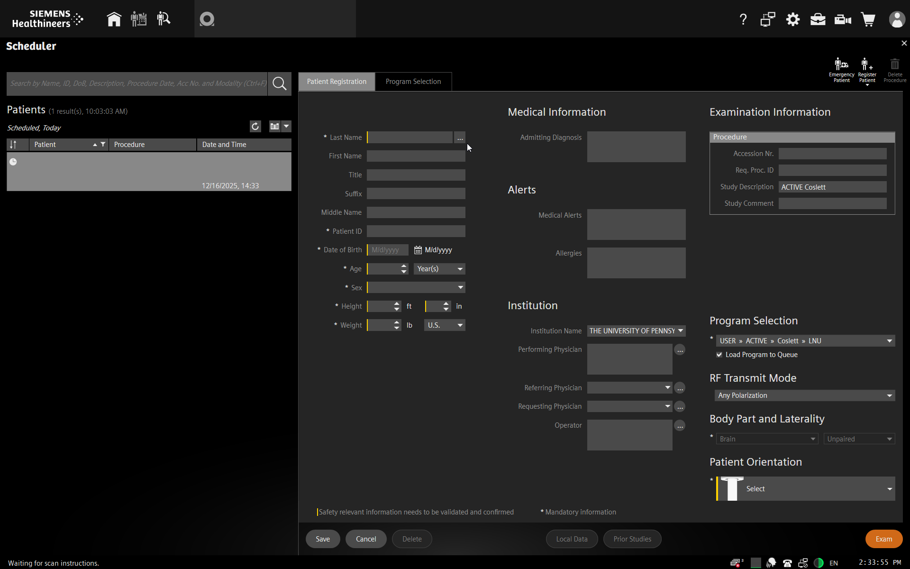

MRI: Registering Participants
===================================

Overview
----------
The following describes the policy for registering participants in the Siemens software for MRI scans. Following these procedures will ensure you and others will be able to find scans in the database and backup once your scan is complete. These procedures also help to ensure participant confidentiallity and protect sensitive information.

Procedure
----------

* From the Home screen on the MRI scanner console, select "Examination"

.. image:: ../images/siemens_home_screen.png

* Choose "Register Patient" in the upper right corner

* Required items on the registration screen are highlighted in orange.

* Use the following procedures for filling out the required fields on the registration card:
	* In the "Last Name" field, enter your PI's last name, underscore, study name, underscore, and subject ID. So, if this were a subject for my study on memory retrieval, I might use something like ``Kirwan_MemRet_sub-01``. **Do not use the participant's actual name.**
	* For date of birth, use today's month and day and the participant's year of birth. **Do not use the participant's actual date of birth**
	* Fill out Sex, height, and weight according to the information the participant provides on their screening form. You can switch from US to metric with the drop-down option.
	* Select your study's protocol from the "Program Selection" drop down. If your protocol is not on the list, you may need to select "Other Examination..." and navigate to your saved protocol.
	* Make sure "Brain" is selected for "Body Part and Laterality".
	* For "Patient Orientation", select "Head First, Supine".
	* Click "Exam". If there are any errors or missing values, the software will highlight them. Otherwise, you should see the scanning page.

