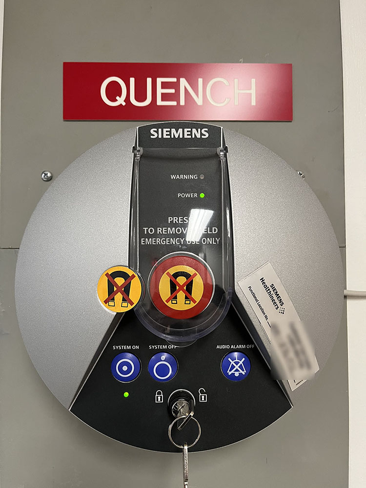
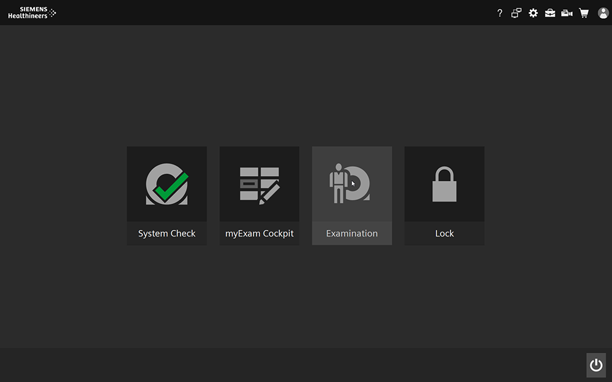

MRI: Restarting, shutting down, and starting up the MRI scanner
===================================

Overview
----------
Occasionally users may need to start the MRI scanner if it has been shut down or restart the scanner in order to clear errors. This how-to walks you through the (re)start process. 

Procedure: Restart
----------
If you receive an error while scanning that instructs you to restart the system, please follow this procedure.

.. Note:: Be sure to take your participant out of the scanner before beginning this process. If you are restarting during a scan session, you will need to re-register your participant and re-do the localizer scan (though any other scans that have been completed and reconstructed should not need to be redone). 

* From the home screen, select the power icon in the lower right corner of the screen.
* Select "Restart System"
* That's it. The system will take about 20 minutes to fully restart and complete all its safety checks before it's ready to scan again.

Procedure: Shut Down
----------
If you receive an error while scanning that instructs you to restart the system, you may wish to do a full shut-down/power-on cycle rather than the restart cycle described above. To shut down the system, please follow this procedure.

.. Note:: Be sure to take your participant out of the scanner before beginning this process. If you are shutting down and restarting during a scan session, you will need to re-register your participant and re-do the localizer scan (though any other scans that have been completed and reconstructed should not need to be redone). 

* From the home screen, select the power icon in the lower right corner of the screen.
* Select "Shut Down System"
* That's it. It takes about 10-15 minutes for the system to shut down. If you're going to start the scanner again, wait a couple minutes (5 min to be safe) and follow the instructions in the next section.

Procedure: Starting the scanner
----------
If you are doing a full shut-down/restart cycle or if the scanner has been shut down prior to your scan (e.g., it was shut down overnight or over the weekend), follow this procedure to start the scanner. 

* Press the "System On" button on the panel with the quench button.

* Wait about 15 minutes while the system goes through the boot up process.
* That's it. When the scanner is ready to scan, there will be a green check mark in the "System Check" section of the Home Screen.

