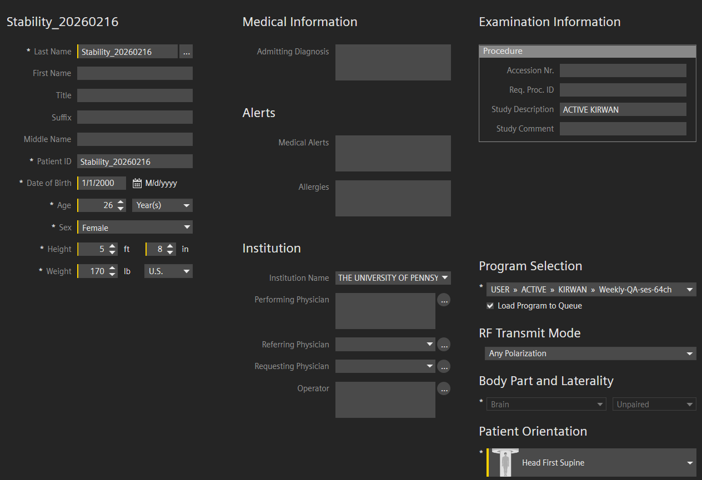
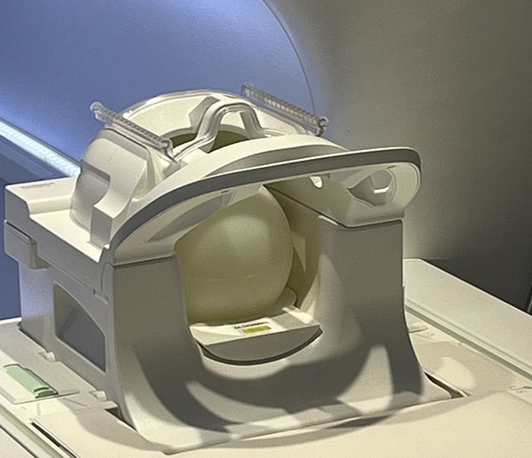

MRI: Stability Scanning
===================================

.. Note::
	Adapted from: John Pyles's protocol described on `MRI Facility QA <https://sites.google.com/view/mri-facility-qa>`_. 

Jump to
-------

* :ref:`overview`
* :ref:`procedure`
* :ref:`references`

----

.. _overview:

Overview
------------

We perform a weekly quality assurance (QA) protocol to monitor the stability of the signal from the Cima.X MRI scanner using the 64-, 32-, and 20-channel head coils and both standard Siemens and CMRR multi-band EPI pulse sequences. The scan protocol is based on the recommendation of John Pyles and colleagues `(Pyles et al, OHBM 2020) <https://sites.google.com/view/mri-facility-qa>`_. Imaging is done on a FUNSTAR (`goldstandardphantoms.com <https://goldstandardphantoms.com/>`_) phantom in the 64- and 32-channel coils using custom 3D-printed phantom holders. Stability is assessed using the Functional Imaging Federated Informatics Research Environment (FBIRN; see `Friedman & Glover, 2006 <https://doi.org/10.1002/jmri.20583>`_) QA metrics, which includes temporal signal to noise ratio (SNR), signal-to-fluctuation noise ratio (SFNR), and mean ghost percentage. The instructions below use a docker-ized version of the FBIRN QA scripts provided by Dr. Chandana Kodiweera of the Dartmouth Brain Imaging Center found `here <https://hub.docker.com/r/diffdocker/fbirnqa>`_.

----

.. _procedure:

Procedure
---------

1. "Register a Patient" with the following parameters. (Note that demographic details are arbitrary, but I like to use biologically plausible sex/height/weight combinations.) Select "Weekly-QA-ses-64ch" as the scan protocol.

2. **64-Channel Coil**. Set up the Funstar phantom in the 64-channel coil using the appropriate 3D-printed phantom holder in the bottom/posterior half of the 64-channel coil. Place the phanom with the black plug at the top. I try to center it but it doesn't have to be perfect. Make sure the phantom holder is level as determined by the spirit level. Slide the top/anterior half of the coil into place and plug it in securely. Use the laser crosshairs to align with the ridges on the anterior/top portion of the coil.

.. Note::
    Make sure both top and bottom halves of the 64-channel are in place and plugged in before aligning with the front of the scanner. Do not rely on the scanner's "auto isocenter" feature for this as it will undershoot actual isocenter, resulting in increased ghosting. See `this blog post <https://mindcore.sas.upenn.edu/2025/04/22/ghosting-in-multi-band-epi-scans/>`_ for more information.

3. Run the anat-localizer scan.
4. Make a note of the starting temperature of gradient coil #4: a) Navigate to the "System Check" screen from the Home Screen and click on the "Switch User" icon. b) Select "Login with Service Key" and enter the service key from Siemens. See Dr. Kirwan if you don't know where the service key is kept. c) Select "Diagnosis" > "Magnet & Cooling" > "Gradient & Bore Temp Status". Make a note of the temperature (in C°) for gradient coil 4 (GC4). d) Leave the System Check window open and navigate back to the "Examination" window by either clicking on it or pressing Alt+Tab.

  .. figure:: ../images/switch_user.png
  
  Switch user icon highlighted in red.
   
  .. image:: ../images/service_key.png

  Login with Service Key screen. Ask Dr. Kirwan for the current service key.

  .. image:: ../images/gradient_temps.png

  Record the temperature of gradient coil 4 (GC4) when directed in the protocol

5. Confirm the positioning of the first EPI scan. The default location is "isocenter", which should be centered on the Funstar phantom. If the phantom is not in isocenter, move the table back to home position and redo the alignment using the laser crosshairs. You'll need to redo the localizer also in that case. 
6. Turn on all coil elements by clicking on them in the protocol parameters window. Failure to do this will result in lower SNR measures.

  .. figure:: ../images/stability_scan_setup.png

   Example positioning for the 64-channel coil stability scans. Note that the coil elements are symbolized by white rectangles with red outlines labeled HC1, HC2, etc. The neck coil 2 (NC2) is not turned on (open red rectangle).

7. Click "Go" to accept positioning and begin the first scan. Positioning for the next 3 scans will be copied from the first scan, but the coil elements will not be all turned on by default. Double-click the remaining functional scans to turn on the coil elements as above. The final functional scan has oblique axial orientation to mimic AC-PC aligned scans. 
8. After each functional scan for the 64-channel coil, you'll need to go back to the "System Check" screen to note the temperature of GC4. Be sure to click "Update" at the bottom of the temperature screen to get the latest temps.
9. Double-click the RF Noise scan and hit "go" to accept defaults.
10. **32-Channel Coil**. After the RF Noise scan finishes, replace the 64-channel with the 32-channel coil. Set up the Funstar phantom in the 32-channel coil using the appropriate 3D-printed phantom holder in the bottom/posterior half of the coil. Place the phanom with the black plug at the top. I try to center it but it doesn't have to be perfect. Make sure the phantom holder is level as determined by the spirit level. Slide the top/anterior half of the coil into place and plug it in securely. Use the laser crosshairs to align with the ridges on the anterior/top portion of the coil.

  .. image:: ../images/stability_32chan.jpeg

11. Add the "Weekly-QA-ses-32ch" scan protocol by clicking the + above the scan sequence list, selecting the "Weekly-QA-ses-32ch" protocol, and clicking the << to bring over the entire protocol. A widow will pop up to confirm that the patient information is correct--select "Yes, but the patient or coils hve moved (new localizer necessary)" and click "Continue". You may need to double-click on the anat-localizer scan and click "Continue" again to get the localizer to run. Click `here <../_images/stability_add_32chan.mp4>`_ to download a video demonstrating this step.
12. After the localizer completes, confirm the positioning of the first EPI scan. The default location is "isocenter", which should be centered on the Funstar phantom. If the phantom is not in isocenter, move the table back to home position and redo the alignment using the laser crosshairs. You'll need to redo the localizer also in that case. 
13. The coil elements of the 32-channel coil will all be turned on by default. Click "Go" to accept positioning and begin the first scan. Positioning for the next scans will be copied from the first scan. Double-click the remaining functional scans to double-check the coil elements are turned on and the poisitioning is correct. You do not need to note the temperature with the 32-channel coil.
14. After the last scan with the 32-channel coil, replace it with the 20-channel coil. Use the "bullet" phantom and holder as below.

  .. image:: ../images/stability_20chan.jpeg

15. **20-Channel Coil**. Add the "Weekly-QA-ses-20ch" scan protocol using the same procedure as above. Run the localizer as above and ensure the scan positioning is correct on the phantom. For the 20-channel coil the default positioning is slightly adjusted from isocenter to be centered on the phantom position. Confirm the defaults are centered on the phantom and accept the positioning.
16. **Post-scan processing**. After all scans have completed, make sure the data have backed up to the stimulus control computer. In the Horos software, export the scans to the `/Users/mriuser/stability` directory. Make sure the Docker Desktop application is running (should be in the command bar at the top of the window). Open the Terminal application and navigate to the stability directory with this command: `cd /Users/mriuser/stability`. Then run the analysis script with the command: `do_stability.sh Stability_[date]` using the same format as in the Patient Registration step above.
17. The script should calculate all stability metrics for all scans and save summary statistics to the project github repo (`https://github.com/MindCORE-MRI/stability-scanning <https://github.com/MindCORE-MRI/stability-scanning>`_). A safari window should open with the graphs of the metrics over time.

----

References
----------
Friedman, L., & Glover, G. H. (2006). Report on a multicenter fMRI quality assurance protocol. Journal of Magnetic Resonance Imaging, 23(6), 827–839. `https://doi.org/10.1002/jmri.20583 <https://doi.org/10.1002/jmri.20583>`_ 

Pyles, J., Verstynen, T., Magerkurth, J., Weiskopf, N., Golay, X., & Inglis, B. (2020, June). 2019 MR Facility Quality Assurance: A publicly available protocol. Abstract presented at the Organization for Human Brain Mapping (OHBM) Annual Meeting. `https://www.humanbrainmapping.org/files/2020/OHBM_2020_Virtual_Abstracts_2.pdf <https://www.humanbrainmapping.org/files/2020/OHBM_2020_Virtual_Abstracts_2.pdf>`_ 