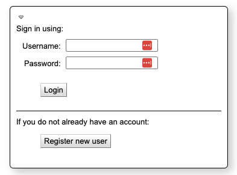

Calpendo Signup
===================================

The MindCORE Neuroimaging Facility uses Calpendo to schedule and track usage of Facility resources, including the MRI scanner, the EEG equipment, and different rooms and spaces. All users are encouraged to sign up for a personal Calpendo account to view schedules. Those with advanced training (e.g., Level 2 training) are authorized to book time on the schedule. 

.. note::
	Please see the documentation on current rates, booking policies, and cancellation policies.

To request an account on Calpendo:
-------

1. `Go to upenn-mindcore.calpendo.com <https://upenn-mindcore.calpendo.com>`_ and click on "Register new user".

2. Click on "Create a local account"
3. Choose a login name and password. Fill out the information for your name and email address.
4. Click "Register" to submit the registration application. New user requests are typically approved within a business day.

To schedule resources on Calpendo:
-------

1. `Go to upenn-mindcore.calpendo.com <https://upenn-mindcore.calpendo.com/>`_ and login with your chosen username and password.
2. Click on "Calendars" on the left of the navigation ribbon.
3. Select the resource(s) you'd like to view by clicking on them in the "Resources" panel on the left of the page. You can select multiple resource calendars to view by holding down control (windows) or command (mac) while clicking those you want to view. 
4. If you are unable to modify a calendar it will be shown in red. To request the ability to edit (e.g., if you are an RA who schedules subjects while another person in your lab is the Level 2 user who does the scanning), please reach out to Dr. Kirwan via `Slack <https://mindcoreneuroimaging.slack.com>`_ or email.
