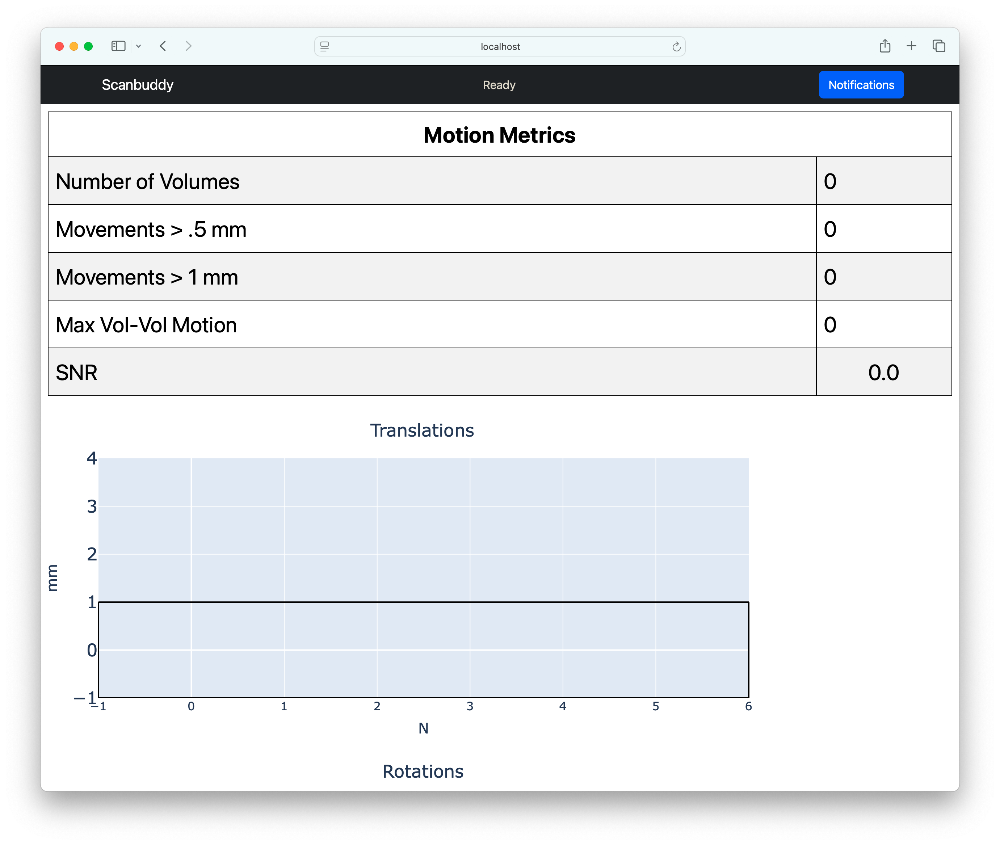

Scanbuddy Real-Time Motion Tracking
===================================

Overview
---------
Scanbuddy is software for monitoring motion in real time during fMRI scan acquisition. Scanbuddy compares each volume to the previous volume and gives an estimate of motion in graphic format. The software also gives an estimate of signal to noise (SNR) for the scan overall. See `here <https://scanbuddy.readthedocs.io/en/main/>`_ for more detail on the development and details of Scanbuddy.

Usage
---------
**Prior to scanning**: 

The Scanbuddy software is installed on the data transfer computer in the MRI control room. Prior to your fMRI scans, you must configure your scan protocols to "auto export" reconstructed volumes in real time to the data transfer computer. See `here <https://scanbuddy.readthedocs.io/en/main/user_docs.html#configuring-the-plugin>`_ for background on this process. Dr. Kirwan can help set this up for your scan if it has been done already. 

**Make sure the software is running**: 

* The Scanbuddy software is installed on the data transfer computer in the MRI control room. The computer is connected to the wall-mounted TV next to the scanner control computer as an external monitor. If Scanbuddy is running, you should see a browser window like this on the TV. If you're seeing this, you should be ready to go:

* If Scanbuddy is not running, the browser will display a message like "Safari Can't Connect to the Server". If that's the case, you'll need to start the software. 
* To start Scanbuddy:
	* First, make sure Docker is running by starting the ``/Applications/Docker`` app. 
	* Next, locate the shortcut on the desktop called "StartScanBuddy.command". Run this command by double-clicking the shortcut.

	.. image:: ../images/scanbuddy_start_command.png

	* Once the script runs, you should see this message in a terminal window:

	.. image:: ../images/scanbuddy_script_ok.png

	* Refresh the browser window and use the username and password displayed in the terminal window from the previous step to log in.

	.. image:: ../images/scanbuddy_login.png

* If Scanbuddy is running and the plugin is configured properly, you should see real-time plots and statistics for motoion during your fMRI scans. Unfortunately, this is not possible for other types of scans (such as structural or diffussion scans). 

.. Note::
	Scanbuddy is compatible with multi-band and multi-echo scans, however it is not compatible with other research protocols such as 3D-EPI or MREG. 

